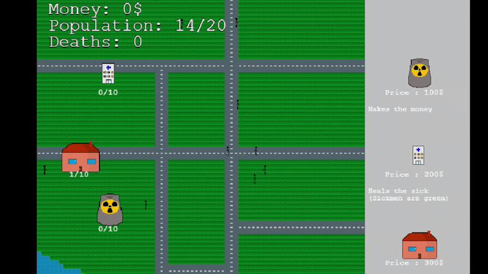
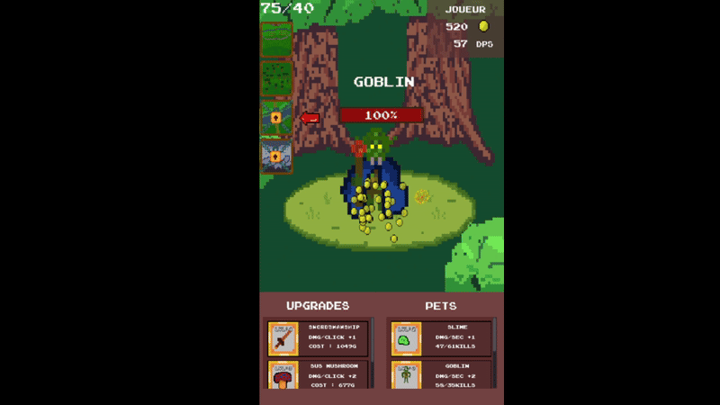
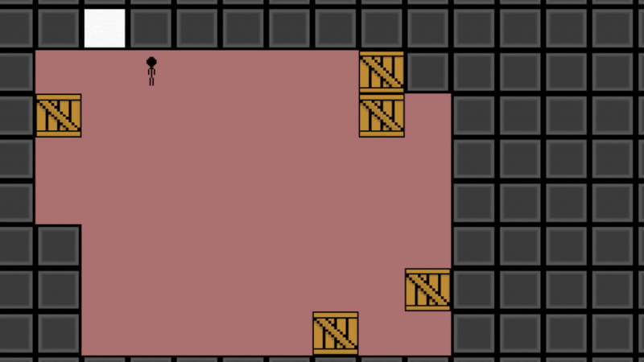

# 🕹️ MiniGames Showcase

| [Confitour](gifs/confitour.gif) | [Confeatures](gifs/confeatures.gif) |
|---------------------------------|-------------------------------------|
|  |  |
| **Description:** A 3D local multiplayer game (2 to 4 players) about making the highest pile of toasts, with power-ups.   **What I learned:** Using viewports for local multiplayer, creating input selection menus, 3D interactions, physics, and particle effects.   🔗 **[Play it here](https://jeuconfiture.itch.io/confitour-gamejamesir2025)** | **Description:** You want to retire from being a hero to raise sheep — a small platformer that goes from the end to the beginning. Will you restore what you did or rush to the start at all costs?   **What I learned:** Parallax effects and 2D physics.   🔗 **[Play it here](https://esir-gamejam.itch.io/confeatures)** |

| [Inventory and more](gifs/inventory.gif) | [City builder](gifs/city_builder.gif) |
|---------------------------------|---------------------------------------|
|  |  |
| **Description:** An experimental prototype testing various features — from enemies with state machines and inventory management to automatic item transportation (inspired by Factorio) and even a rhythm mini-game with an in-game editor.   **What I learned:** Building a proper inventory system and creating shaders.   🔗 **[Play it here](https://baptistea.itch.io/atinyfantasy-v001)** | **Description:** *OverPopul(arN)ation* is a 2D city builder where you must expand your population without spreading a virus.   **What I learned:** Working with 2D tilemaps.   🔗 **[Play it here](https://baptistea.itch.io/overpopularnation)** |

| [Clicker](gifs/clicker.gif) | [Puzzle game](gifs/puzzle.gif) |
|-----------------------------|--------------------------------|
|  |  |
| **Description:** A small mobile clicker game inspired by *Clicker Heroes*.   **What I learned:** Developing for mobile and creating scrollable UIs.   🔗 **[Play it here](https://baptistea.itch.io/tamer-clicker)** | **Description:** A puzzle game about pushing crates to clear your path — inspired by Pokémon minigames where you push rocks or slide on ice.   **What I learned:** Designing levels.   🔗 **[Play it here](https://baptistea.itch.io/jeu-de-caisses)** |
